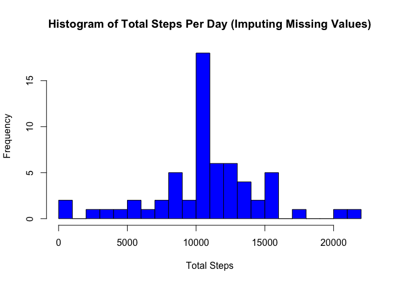

# Reproducible Research: Peer Assessment 1
# Personal Activity Monitoring Device Data Analysis

This document analyizes data collected from a personal fitness monitor device
over a two month period (October and November, 2012).  The device recorded all 
steps taken by the subject during the monitoring period in 5-minute intervals (
i.e., Interval # 1200 corresponds to 12 noon).

## Loading and preprocessing the data
The csv file 'activity.csv' was obtained from the Reproducible Research site.
The file is first loaded using read.csv.  The dates are then converted to POSIXct
format using the 'lubridate' package. The 'interval' variable is converted to a 
factor. Finally, a new column is created containing the day of the year for each
entry.


```r
library(lubridate)
# read in data
steps_data <- read.csv("activity.csv", stringsAsFactors = FALSE)
# convert dates to POSIXct
steps_data$date <- ymd(steps_data$date)
# convert interval column to factor
steps_data$interval <- factor(steps_data$interval)
# create new column reporting day of the year
steps_data$year_day <- yday(steps_data$date)
```

## What is mean total number of steps taken per day?

This histogram shows the frequency of the total number of steps in a day for the 
61 days in the study. Intervals containing no value for the number of steps are 
ignored in the step count.  Since there are several days with large numbers of NA
values, there is a high frequency of days with less than 1000 steps.


```r
# calculate the total number of steps per day of the year, ignoring NAs
steps_data_bydate <- tapply(steps_data$steps, 
                            steps_data$year_day, 
                            function(x) sum(x, na.rm = TRUE))

# generate histogram of distribution of steps per day
hist(steps_data_bydate, 
     breaks = 20, 
     main = "Histogram of Total Steps Per Day", 
     xlab = "Total Steps",
     col = "blue")
```

 

```r
# calculate mean and median
mean_steps <- mean(steps_data_bydate, na.rm = TRUE)
median_steps <- median(steps_data_bydate, na.rm = TRUE)
```

The mean number of steps per day is 9354.23.

The median number of steps per day is 10395.

## What is the average daily activity pattern?

The average number of steps per interval across all 61 days in the study is 
calculated and used to visualize average activity for each interval of the day.


```r
# calculate the average number of steps per interval across all days
mean_steps_per_interval <- tapply(steps_data$steps, 
                         steps_data$interval, 
                         mean, na.rm = TRUE)

# generate plot of the overge number of steps as function of interval
plot(levels(steps_data$interval), 
     mean_steps_per_interval, 
     type = "l", 
     xaxt = "n",
     xlab = "Interval",
     ylab = "Mean Steps",
     main = "Mean Number of Steps Per Interval")
     
# modify x axis tick locations
axis(1, at = c(0, 600, 1200, 1800, 2355))
```

 

```r
# determine interval with maximum average number of steps
max_interval <- names(which.max(mean_steps_per_interval))
```

The interval containing the maximum mean number of steps is 835.

## Imputing missing values

In order to remove NA values, the mean number of steps per interval across all 61
days is used.  These values rounded to nearest number of steps and are then used 
to replace NA values.  As a result of imputing values, the total number of steps 
for several days is moved closer to the mean value for the sample. 


```r
# calculate total number entries with NA in dataset
total_NAs <- sum(!complete.cases(steps_data))

# replace NAs with average number of steps for appropriate interval, rounding to 
# nearest number of steps
for (i in 1:nrow(steps_data)) {
    if (is.na(steps_data$steps[i]) == TRUE) {
        steps_data$steps[i] <- as.integer(round(mean_steps_per_interval[steps_data$interval[i]]))
    }
}

# calculate number of steps per day with no NAs
steps_data_bydate_noNAs <- tapply(steps_data$steps, 
                                  steps_data$year_day, 
                                  function(x) sum(x))

# generate histogram of distribution of steps per day
hist(steps_data_bydate_noNAs, 
     breaks = 20, 
     main = "Histogram of Total Steps Per Day (Imputing Missing Values)", 
     xlab = "Total Steps",
     col = "blue")
```

 

```r
# calculate mean and median of distribution
mean_steps_noNAs <- mean(steps_data_bydate_noNAs, na.rm = TRUE)
median_steps_noNAs <- median(steps_data_bydate_noNAs, na.rm = TRUE)
```

There were a total of 2304 NAs in the original dataset.

The mean number of steps per day with value imputing is 10765.64.

The median number of steps per day with value imputing is 10762.

## Are there differences in activity patterns between weekdays and weekends?

In order to look for differences in activity between weekdays and weekends, the 
average number of steps per interval is calculated separately for weekdays and 
weekends.  There is a clear peak in activity on weekdays at around 8:30 AM, whereas
on weekends there is a higher average activity sustained throughout the day.


```r
# new column created reporting weekday/weekend
steps_data$weekend <- wday(steps_data$date) %in% c(1,7)
steps_data$weekend <- factor(steps_data$weekend, 
                             levels = c(FALSE, TRUE), 
                             labels = c("weekday", "weekend"))

## Calculate mean steps per interval for weekdays and for weekends
mean_steps_per_interval_bywkday <- round(with(steps_data, 
                                        tapply(steps, 
                                               list("interval" = interval, 
                                                    "weekday-weekend" = weekend), 
                                               mean))
                                        , 3)
mean_steps_per_interval_bywkday_df <- data.frame("interval" = steps_data$interval[1:288],
                                                 mean_steps_per_interval_bywkday)

# using tidyr to organize results from tapply
library(tidyr)
library(lattice)
mean_steps_per_interval_bywkday_df <- gather(mean_steps_per_interval_bywkday_df, 
                                          wkday_wkend, 
                                          mean_steps, 
                                          weekday:weekend)

# plotting time series using lattice
at <- c(0, 73, 145, 217, 288)
labels <- c("0", "600", "1200", "1800", "2355")

p1 <- xyplot(mean_steps ~ interval | wkday_wkend, 
       data = mean_steps_per_interval_bywkday_df, 
       scales = list(x = list(at = at, labels = labels)),
       strip = strip.custom(factor.levels = c("Weekday", "Weekend")),
       type = "l", 
       xlab = "Interval",
       ylab = "Mean Number of Steps",
       layout = c(1, 2))
print(p1)
```

 
